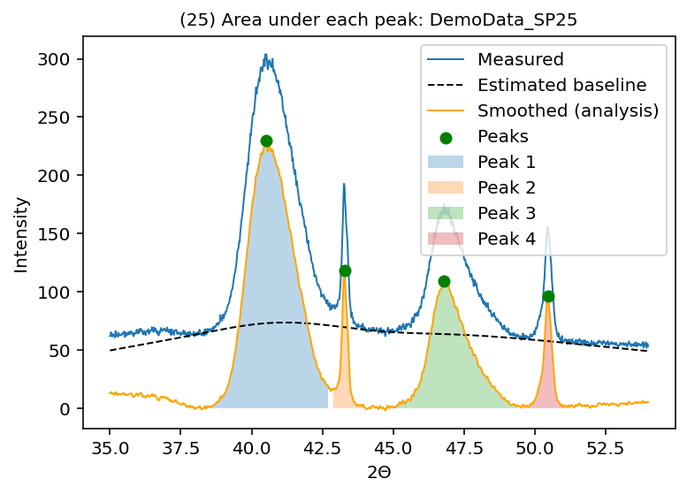

# Automated XRD Peak Analysis for Expanded Austenite
**Demo of Bachelor Thesis Project – Daniel Hristov**

## Overview

This repository contains demo of a **semi-automated Python application for the analysis of in-situ X-ray diffraction (XRD) data**, developed as part of my Bachelor’s thesis *“Depth Resolved Phase Analysis of Expanded Austenite”* at **Universität Leipzig**.

The project focuses on automating the analysis of large XRD diffractogram datasets generated during in-situ nitriding, carburizing, and sputtering experiments. Such experiments can produce **hundreds of diffractograms per day**, making manual analysis slow, error-prone, and impractical.

The application:
- Automatically removes background intensity
- Detects and classifies diffraction peaks
- Calculates peak position (2θ), intensity, FWHM, and peak area
- Exports results to **Excel** and **PDF**

The physical background, algorithms, validation, and limitations are described in detail in the accompanying bachelor’s thesis and can be provided upon request.

### Data privacy & anonymization
- **Filenames are anonymized** (e.g., `DemoData_SP*.nja`) to preserve scan ordering (`_SP###`) while removing identifying information.
- The repository includes an **optional synthetic “demo” dataset / workflow** so the pipeline can be tested without restricted data.

---

## Scientific Background (Short)

Expanded austenite forms during low-temperature nitriding or carburizing of stainless steels. Its XRD analysis is challenging due to:
- Asymmetric and broadened diffraction peaks
- Small peak separations between expanded and base material phases
- Strong intensity variations during in-situ experiments

The script implements:
- **Asymmetric reweighted penalized least squares (arPLS)** baseline correction
- **Window-based peak detection** inspired by OriginLab algorithms
- **Simpson integration** for peak area calculation
- Automated handling of duplex and austenitic steels

---

## Project Structure

```
IOM_PeakOptim/
│
├── Main.py   # Main analysis script
├── Samples/                        # Input XRD files (.nja)
├── Results/
│   ├── Combined/                   # Combined PDF + Excel output
│   └── Single/                     # Individual PDFs per scan
├── .venv/                          # Python virtual environment
└── README.md
```

---

## Requirements

### Software
- **Python ≥ 3.10**
- **Spyder IDE** (tested with Spyder 6)
- **VS Code**
- macOS / Linux / Windows

### Python Packages
- numpy
- scipy
- matplotlib
- pandas
- openpyxl
- PyPDF2
- spyder-kernels==3.1.* (required for Spyder integration)

---

## Installation (Recommended Setup)

### 1. Create a virtual environment

```bash
python3 -m venv .venv
source .venv/bin/activate
```

### 2. Install dependencies

```bash
python -m pip install --upgrade pip
python -m pip install -r requirements.txt
```

> If you use Spyder (recommended) with this virtual environment, ensure:
>
> ```bash
> python -m pip install "spyder-kernels==3.1.*"
> ```

### 3. Configure Spyder to use the environment

In Spyder:
- Preferences → Python Interpreter
- Select **Use the following interpreter**
- Choose:
  ```
  PeakOptim/.venv/bin/python
  ```
- Restart Spyder

---

## How to Run the Project (Spyder)

1. Open `Main.py` in Spyder  
2. Ensure the XRD files (`.nja`) are into the `Samples/` directory  
3. Run the script

The script will:
- Process all diffractograms automatically
- Generate plots during execution
- Save results to:
  ```
  Results/Combined/<date>/<sample_name>/
  Results/Single/<date>/<sample_name>/
  ```

---

## How to Run (CLI / Terminal)

From the project folder:

```bash
python Main.py --help
```

Examples:

```bash
# Default
python Main.py

# Headless (no interactive plots; no PDF generation, perfect for VS Code)
python Main.py --no-plots

# Cut range
python Main.py --cut 42 44

# Custom paths
python Main.py --samples Samples --results Results
```

---

## VS Code Usage Notes

When running the project from **VS Code**, it is recommended to use the `--no-plots` flag.

VS Code’s default Python execution environment does **not provide a fully interactive graphical backend** comparable to Spyder’s IPython console. As a result, interactive Matplotlib windows may not display correctly or may block execution.

For VS Code, run:

```bash
python Main.py --no-plots
```

### Data anonymization

The demo dataset consists of experimental XRD measurements with:
- non-numeric instrument headers removed
- filenames anonymized to preserve scan order while removing identifying information

The numeric diffraction data (2θ and intensity values) is unchanged.

---

## Output

### Generated Data

**Excel (.xlsx):**
- Peak position (2θ)
- Intensity
- FWHM
- Integrated peak area
- Structured by phase (expanded/base, 111/200)

**PDF files:**
- One combined PDF with all scans
- Individual PDFs for each diffractogram
- Visualized peak regions and integration areas

---


## Limitations

Known limitations:
- Very low-intensity peaks are not be detected automatically
- Peaks closer than ~0.4° in 2θ may merge
- Extremely broad peaks require manual handling

Despite these limitations, the workflow reduces analysis time from **hours to seconds**.

---
---

## Motivation for Hackathon Submission
This project demonstrates:
- Automation of a real-world scientific workflow
- Application of numerical methods and data analysis
- Scientific visualization and reporting
- Research-grade Python used in practice

It is presented as **prior work** and serves as a foundation for further development.
---

## Visual Output Examples

### Single diffractogram analysis


## Author
**Daniel Hristov**  

